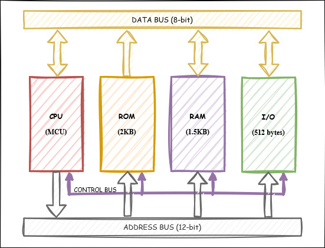
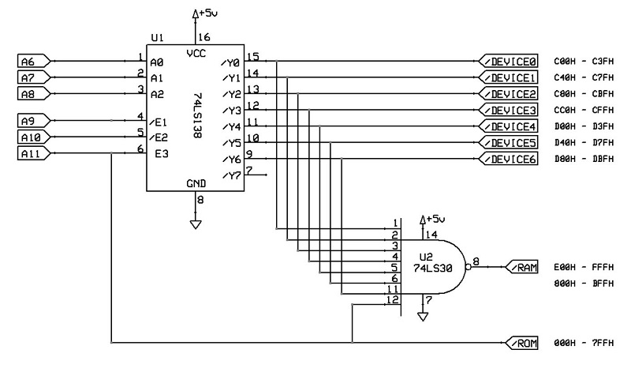

# PICO - A very simple and small 8-bit microcomputer
This is a home project for a very simple and small 8-bit microcomputer (also picocomputer), based on Von Neumann architecture and 4KB address bus.
The CPU of PICO is an emulated CPU, implemented by an ad-hoc programmed PIC microcontroller.


## Features
- Von Neumann architecture
- 8-bit Data BUS
- 12-bit Address BUS
- Memory mapped I/O
- Time based read/write operations
- Up to xxx KHz BUS clock


## Architecture


### BUS
* Power lines :
	* +5V
	* Gnd
* Address lines :
	* A0-A11 - 12-bit Address for a total of 4KBytes
* Data lines :
	* D0-D7 - 8-bit Data
* Control lines :
    * /RD - read operation. "Lo" value indicates the device is being read by the CPU.
	* /WR - write operation. "Lo" value indicates the device is being written by the CPU.
    * BCLK - bus clock. Reference clock for the bus operations.

### Address Map
The memory and registers of the I/O devices are mapped on the same address space (memory mapped I/O), so a memory address may refer to either a portion of physical memory or to registers of the I/O device.
The address map of the PICO system looks like this:

| Addresses   |  Size | Assignment           
|-------------|-------|----------------------
| E00H - FFFH |  512B | RAM (banks 1)
| DC0H - DFFH |  64B  | unused (not mapped)
| C00H - DBFH |  448B | I/O (devices 0..6 for 64 bytes each)
| 800H - BFFH | 1024B | RAM (banks 0)
| 000H - 7FFH | 2048B | ROM

### Read/Write Operations
Read and Write operations are time based sequences of command, generated from the CPU to the target device or memory.
The CPU sets the address and/or data lines on the rising edge of the bus clock signal, and reads/holds the data on/until the next rising edge.

##### Write Operation
1. CPU writes and latches Address on BUS
2. CPU writes Data on BUS
3. CPU sets Control Line */WR*
4. DEVICE latches Data from BUS
5. CPU unsets Control Line */WR*

```text
                  __     __     __     __     __   
BCLK          ___|  |___|  |___|  |___|  |___|  |__
                        T1    T2
CPU WRITE                 ____________ 
ADDRESS       -----------<____________>------------

CPU WRITE                   ____ 
DATA          -------------<____>------------------

CPU SET       ____________       __________________
/WR                       |_____|

```

##### Read Operation
1. CPU writes and latches Address on BUS
2. CPU sets Control Line */READ*
3. DEVICE writes Data on BUS
4. CPU reads Data from BUS
5. CPU unsets Control Line */READ*

```text
                  __     __     __     __     __   
BCLK          ___|  |___|  |___|  |___|  |___|  |__
                        T1    T2
CPU WRITE                 ____________ 
ADDRESS       -----------<____________>------------

CPU SET       ____________        _________________
/RD                       |______|

CPU READ                        _
DATA          -----------------<_>-----------------

```

### The pico CPU
Pico CPU specifications:
- The CPU instructions used to access the memory are the same used for accessing I/O devices.
- BUS content remains the same until next change.


## Hardware

### Motherboard

##### Address MAP Decoder
The placement of address space assignments is designed to minimize the number of gate ports needed to decode addresses.
Two gates are required to decode between RAM and I/O addresses, and to split the I/O addresses into 1 to 7 devices enable signal.
Zero gates are required to decode ROM addresses.



##### BUS Clock and Single Clock Execution

### CPU Card

### ROM Card

### RAM Card

### I/O Device Cards

##### 8x8 LED matrix display

##### 16x2 LCD display

##### 4x4 switch keyboard


## Changes
See file [CHANGES](CHANGES.md) for the project resources change logs


## Future Plans
See file [TODO](TODO.md) for the project future plans


## About
Author : Alessandro Fraschetti (mail: [gos95@gommagomma.net](mailto:gos95@gommagomma.net))


## License
This project is licensed under the [Creative Commons BY-SA 3.0](http://creativecommons.org/licenses/by-sa/3.0/) License
